# Examen 1ª Evaluación (2ª Parte) - Control de Versiones

---

## Instrucciones
- Los commits de cada apartado deben tener el mensaje *"Apartado X - descripción del cambio realizado"*
- Entrega en la tarea de Moodle tu repositorio
- Solo se corrigen los commits que estén en el repositorio remoto

### Apartado 1

- Clona este repositorio.
Iremos al apartado que vemos en la imagen. 

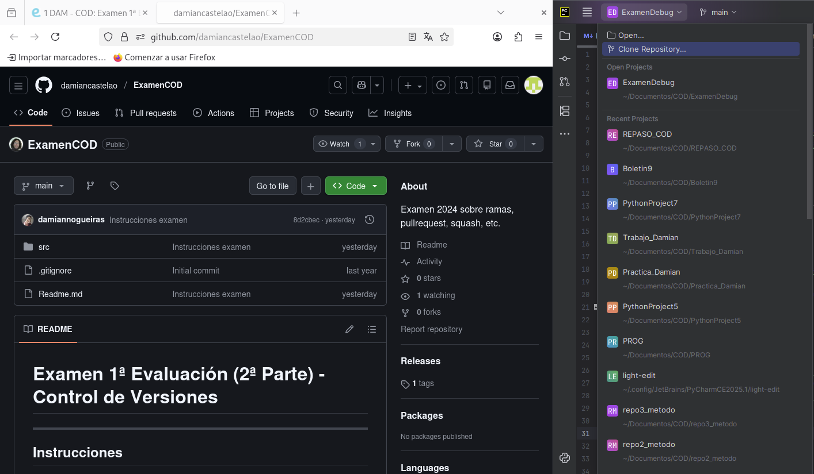

Ponemos la URL del repositorio

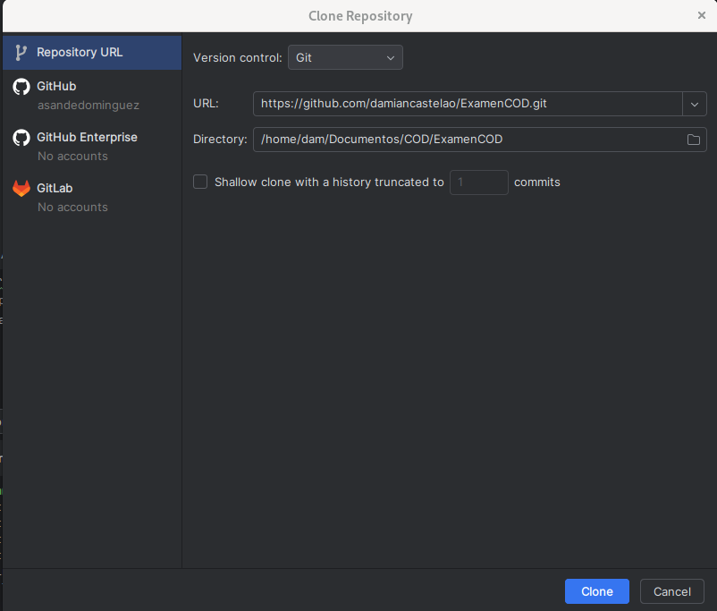

En manage remotes pondremos nuestro repositorio

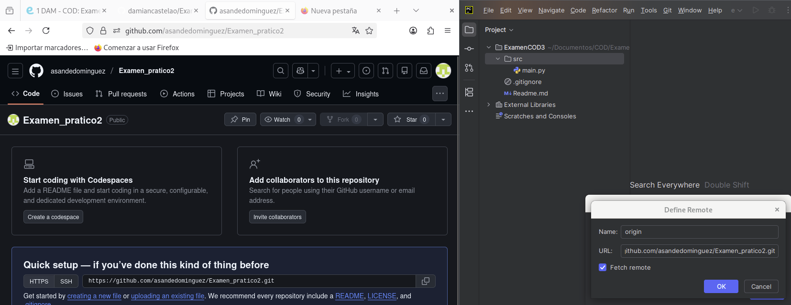

Haremos commit y push y listo

## ADRIÁN SANDE DOMÍNGUEZ

Pregunta 
- ¿Qué paso es fundamental cuando clonamos un repositorio ajeno para que podamos subir nuestros propios commits? Explícalo y utiliza capturas de pantalla.

Necesitamos tener permisos de escritura en el repositorio remoto, de esta forma podremos hacer push a nuestro propio repo, por ello también despues de clonarlo debemos establecer a donde queremos subir los commits y push en el lugar que indique en la tercera imagen

### Apartado 2

- Realiza una modificación en el código en la web de tu repositorio en GitHub

Entramos en el Readme y le damos al icono del lapiz

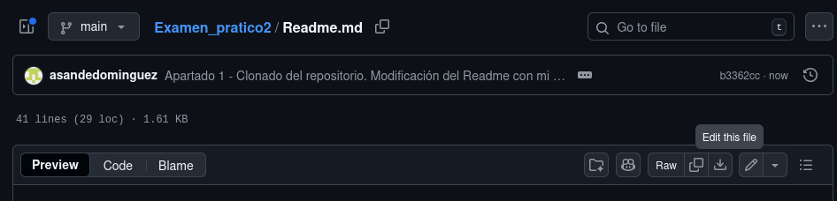

Mi cambio a sido poner una barra al principio del parrafo

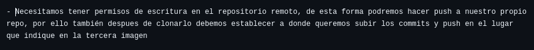

Hacemos commit

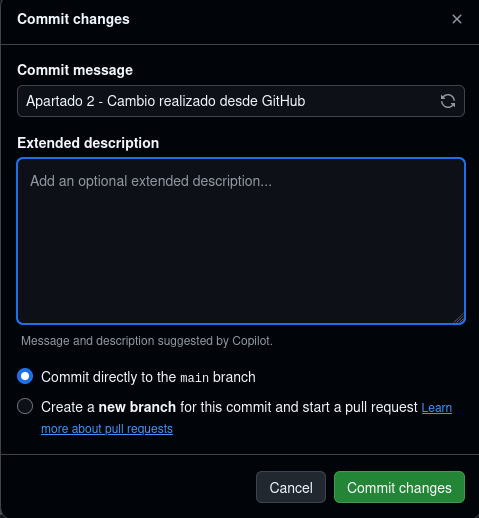

- Utiliza fetch para descargar los cambios realizados en tu repositorio.
Hacemos lo siguiente:

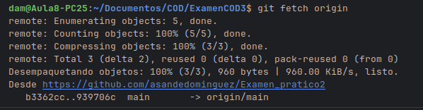

Pregunta

- Explica los pasos para que el código modificado en GitHub, llegue a tu rama principal local. Explícalo con capturas de pantalla.
Hacemos git status y vemos que dice lo siguiente

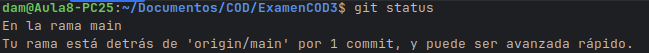

Luego un git merge origin/master (no lo pongo en captura porque ya lo hice y se me olvido la captura)

Con esto ya vemos que aparece el cambio realizado:

### APARTADO 3

- Realiza otro cambio desde la web de tu repositorio en GitHub.

La palabra apartado toda en mayusculas

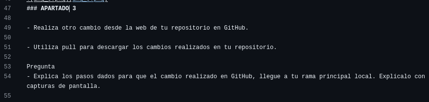

- Utiliza pull para descargar los cambios realizados en tu repositorio.

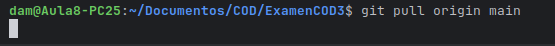

Tuve que hacer un --rebase por un commit que tenia mal hecho
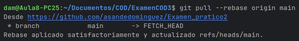

Pregunta

- Explica los pasos dados para que el cambio realizado en GitHub, llegue a tu rama principal local. Explícalo con capturas de pantalla.

El proceso esta en las anteriores capturas. Primero hice un cambio en GitHub, le hice commit, en local hice un git pull origin/master, como tuve un error tuve que realizar el pull con --rebase, por el último comprobe los cambios y ahi estaban 
